# eShop example
The *eShop* example is a simple .NET project that demonstrates using CargoChain.

### Project stack
- ASP.NET Core MVC
- LiteDB for application storage (Embedded NoSQL database for .NET)
- CargoChain [C# Enterprise SDK](https://github.com/CargoChain/doc/wiki/C%23-SDK)

### What you will learn
- How to integrate CargoChain in your .NET project
- How to use the CargoChain [C# Enterprise SDK](https://github.com/CargoChain/doc/wiki/C%23-SDK)
- How to authenticate and get CargoChain access tokens in your application ([see the CargoChain authentication documentation](https://github.com/CargoChain/doc/wiki/V2-Authentication#service-based))
- How CargoChain help you to synchronize data between applications using [subscriptions](https://github.com/CargoChain/doc/wiki/V2-API#subscriptions)

## eShop applications
The *eShop* example is really basic shop that allows to add products by specifying a name, a description and a price. Then you can order the available products. When a product is ordered, the carrier specifies the position of the product and finally the product is delivered.

The *eShop* example is based on two web applications:
- **The Shop app**: the user can add products and order them
- **The Carrier app**: when a product is ordered, the carrier user can specify the position of the product (and also an optional temperature) and can specify that the product has been delivered.

### Applications workflow
The workflow of the applications is essentially based on the state of a product:
State | Description
---- | ----
`Available` | the product has been created and can be ordered by the user
`Ordered` | the product has been ordered and the carrier has to deliver it
`Delivered`| the product has been delivered to the buyer

Here is a full example that demonstrates how the _eShop_ applications work.

#### Add a new product (Shop app)
First, you have to access to the Shop home page. In this example, no product has been added yet.

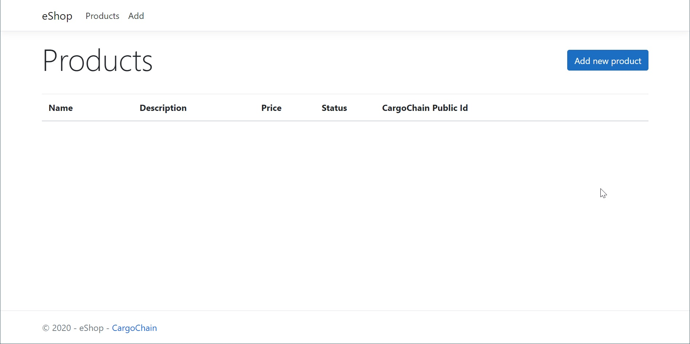

Then you can add a new product by clicking the **Add new product** button.

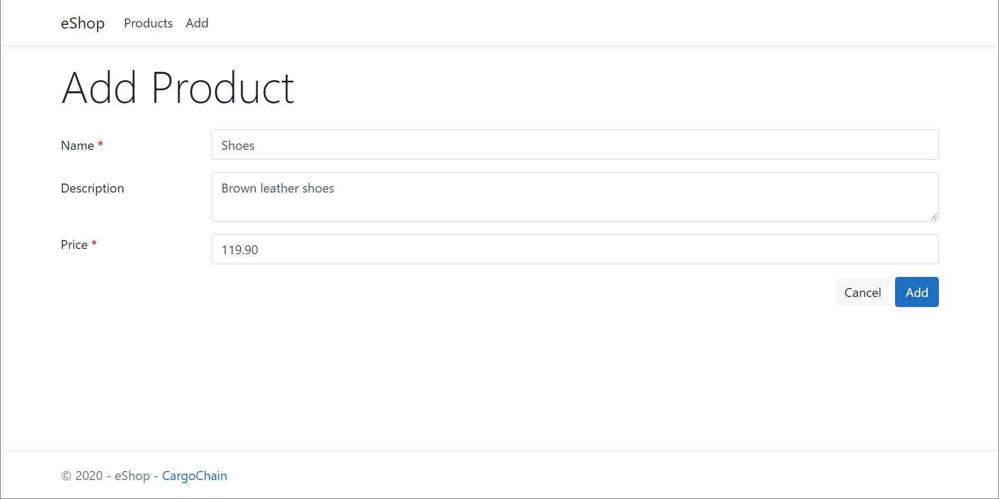

The product has been added in the Shop app.

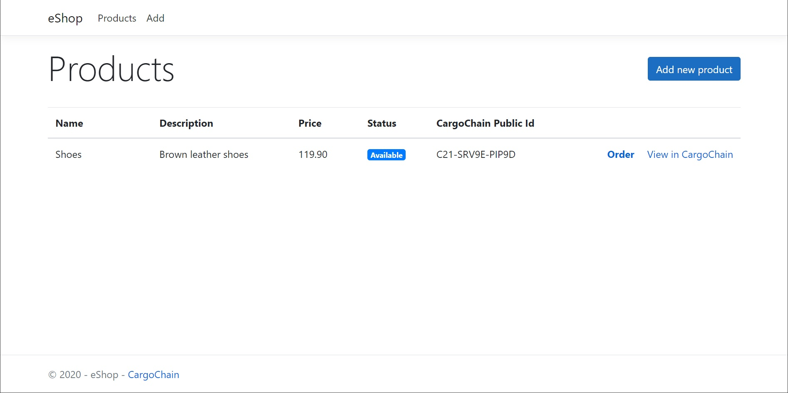

The Shop application (same for the Carrier application) uses a local database (LiteDB) mainly for storing the products. **But for each
product, we create a profile in CargoChain. It allows to communicate between the Shop and the Carrier applications. These applications
don't share their local database.**

#### Product profile in CargoChain
When a product is created in the Shop application, we also create a profile in CargoChain. The **View in CargoChain** link allow
to view this profile in CargoChain.

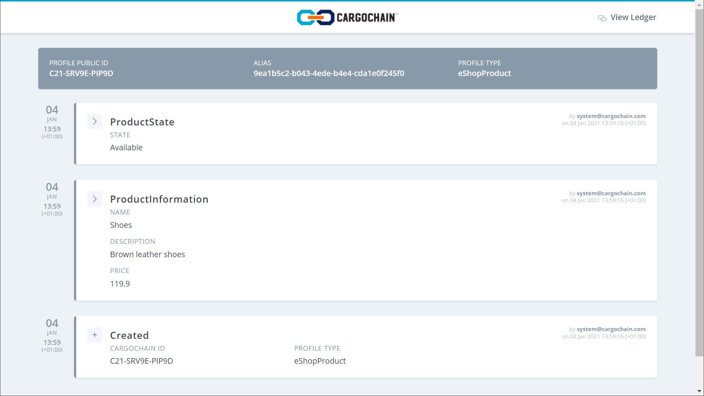

We can see that 3 events have been pushed in CargoChain. The **Created** event is automatically pushed when a new profile is created in CargoChain.
The 2 other events are custom events pushed by the Shop application:
- `ProductInformation`: this event is pushed in order to share the product details (the name, description and price).
- `ProductState`: pushed each time the status of the profile has changed.

#### Order a product (Shop app)
The user can order a product by clicking the **Order** link. Then, (s)he has to specify a delivery address.

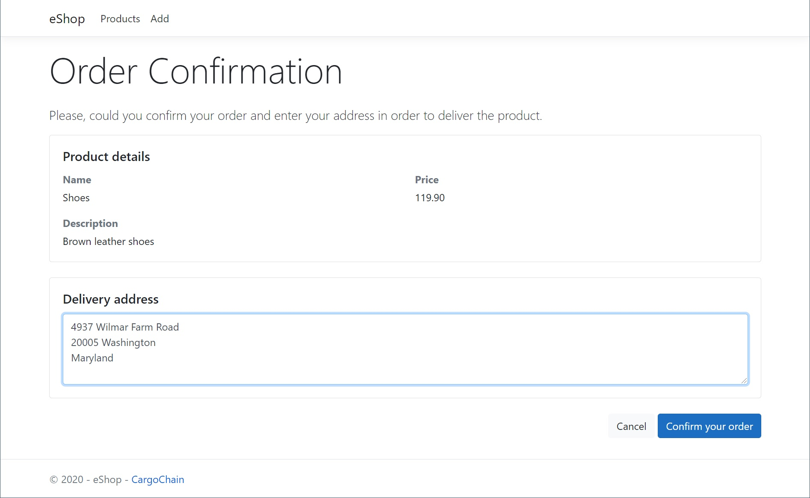

Once the button **Confirm your order** is clicked, the status of the product changes.

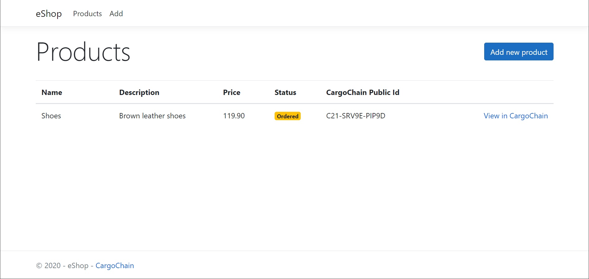

#### Product synchronization (Carrier app)
The Carrier application uses a CargoChain _subscription_ (web hook) in order to receive a notification when the status of a product has changed (based on the **ProductState** event that is pushed in CargoChain by the Shop application). When the Carrier application gets this notification, it can get the events that have been pushed in CargoChain in order to re-create the product in its own local database.

The product is now accessible in the Carrier application.

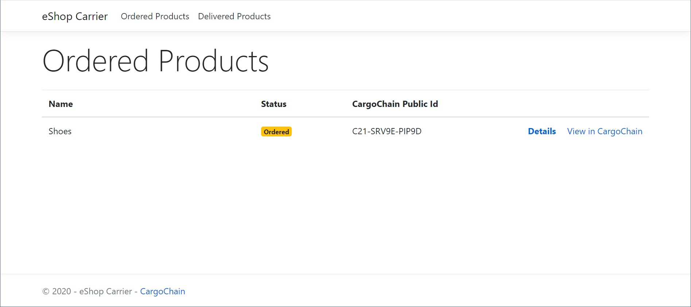

#### Add product position (Carrier app)
The carrier can publish the position of the product. It allows to track the product.

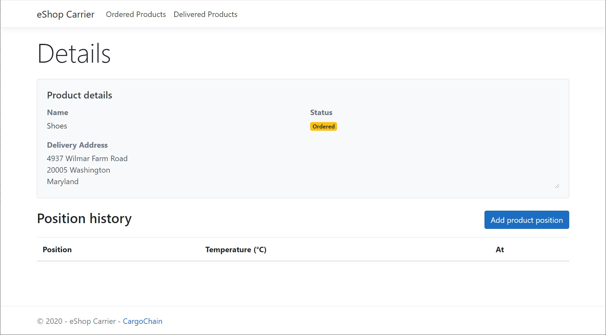

The carrier can also specify a temperature each time a new position is pushed.

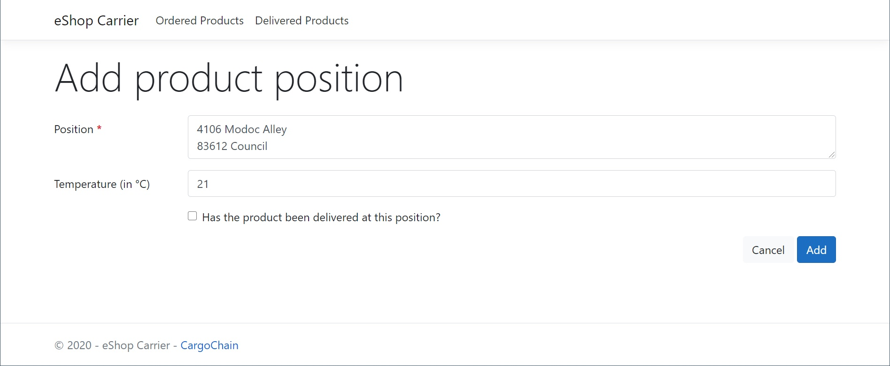

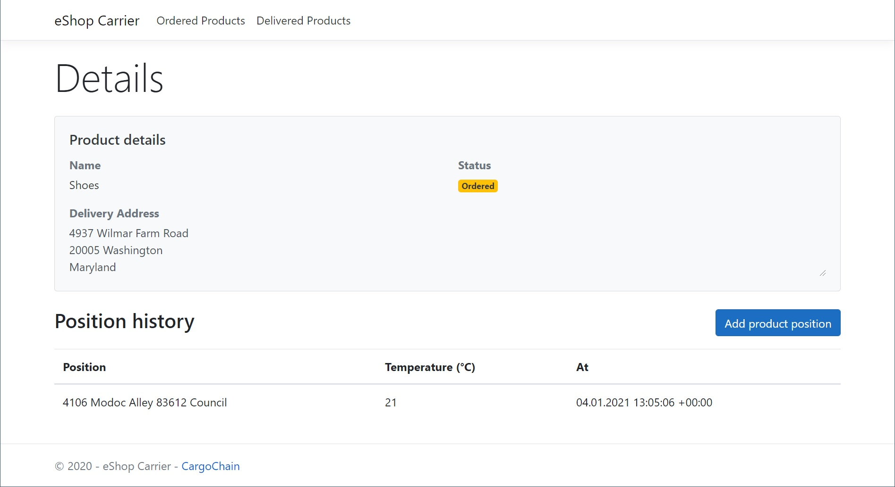

> The position and the temperature is pushed in CargoChain, but this information is not synchronize
in the Shop application.

#### Deliver the product (Carrier app)
The _Add product position_ form allow to specify if the product has been delivered.

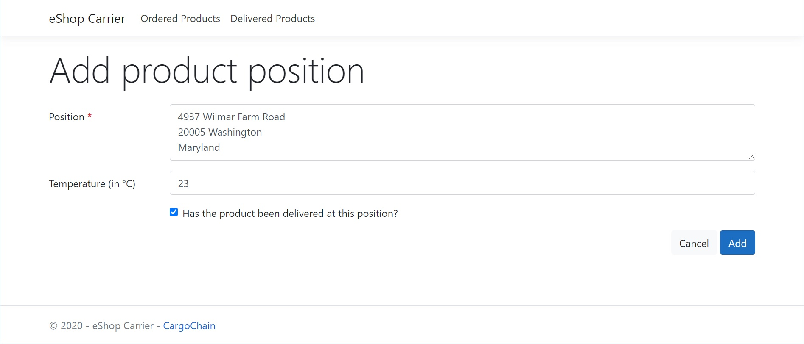

If the checkbox is clicked, the status of the product changes to **Delivered**.

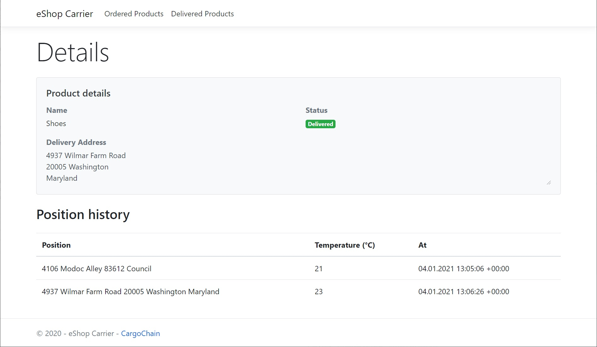

#### Product synchronization (Shop app)
Like the Carrier app, the Shop app uses a CargoChain _subscription_ in order to receive a notification
when the status of the product has changed. So when the status changes in the Carrier app from **Ordered** to **Delivered**,
the Shop app is notified and can read the events from CargoChain and see that the status has changed (by reading the **ProductState** event).

The home page of the Shop app indicates now the status of the product has changed.

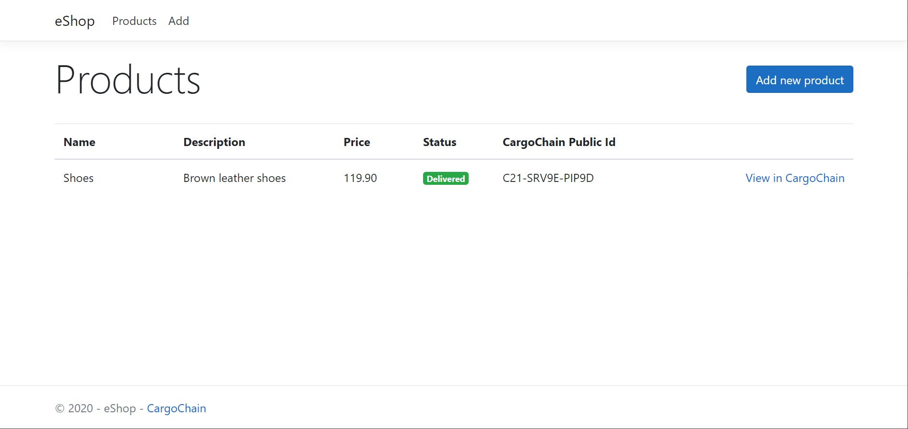

#### Profile events and ledger
The corresponding profile is available in CargoChain by using the **View in CargoChain** link. All the events that have been
pushed by both the Shop and the Carrier apps are visible.

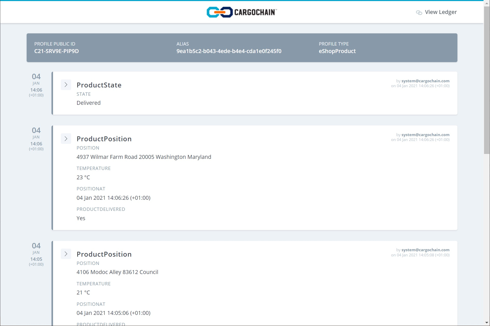

By clicking the **View Ledger** link, a visual representation of the CargoChain blockchain is displayed.

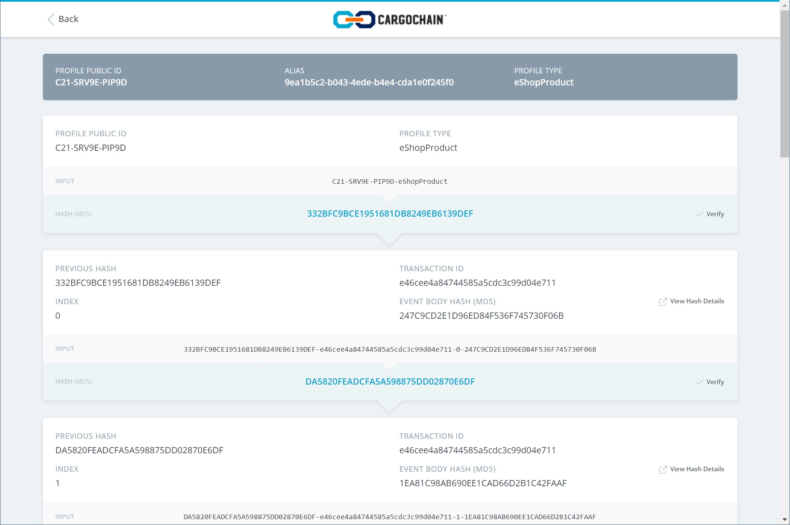

## Visual Studio solution
The source code is split into 3 projects:
Project | Description
---- | ----
eShop.Shop | The Shop web application
eShop.Carrier | The Carrier web application
eShop.Lib | Source code that is common to the Shop and Carrier apps

## How to run the eShop example

### CargoChain Setup

### Server deployment with public access

### localhost public access
 